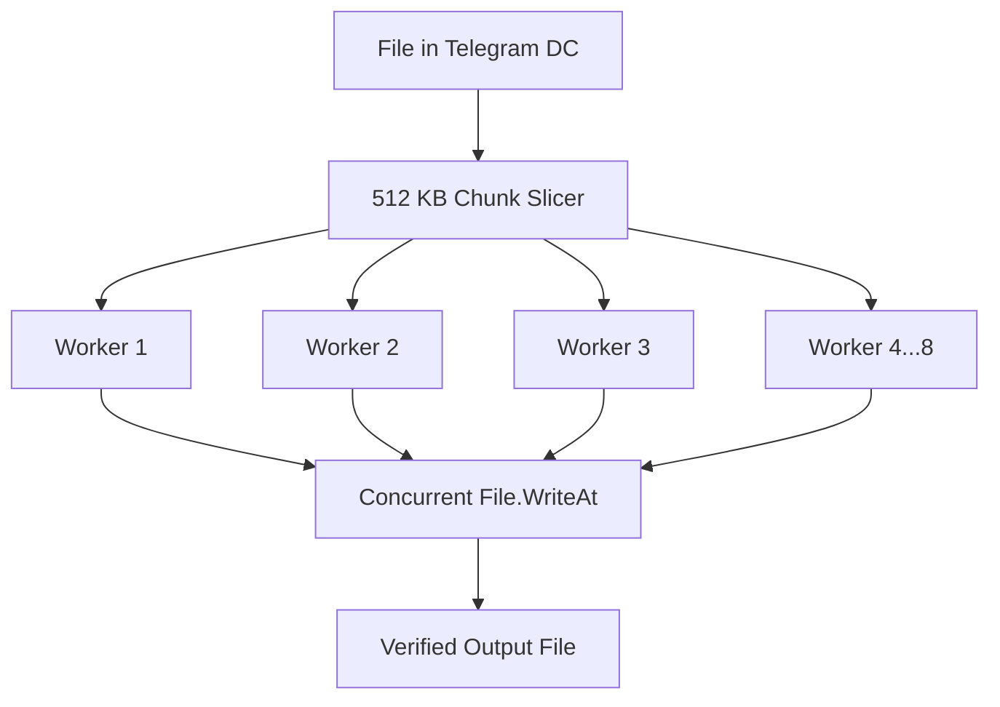

**TelegramDL** is specifically engineered to maximize speed, reliability, and flexibility when downloading media from Telegram.

---

## Supported Link Formats

TelegramDL features an intelligent URL parser (`pkg/downloader/parser.go`) that handles direct messages, continuous ranges, and forum topics:

| Link Format | Type | Description |
| :--- | :--- | :--- |
| `https://t.me/c/2121902112/31449` | Single private channel message | Downloads media from message `31449` |
| `https://t.me/c/2121902112/31449-31455` | **Message Range** | Queues all messages from `31449` to `31455` |
| `https://t.me/publicchannel/1234` | Public channel or supergroup | Downloads message `1234` from public channel |
| `https://t.me/c/2121902112/450/455` | Topic message | Downloads message `455` within topic `450` |

---

## Multi-Worker Chunk Download Engine

The download engine (`pkg/downloader/engine.go`) performs parallel segmented downloads directly over the MTProto protocol:

### Engine Highlights:
1. **Per-file Concurrency**: Assigns up to 8 parallel workers per download, saturating your available network bandwidth.
2. **Global Concurrency Semaphore**: Throttles active tasks (`MaxConcurrentDownloads`, default 3 active tasks) to avoid rate limits.
3. **Deduplication Safeguards**: If a file already exists on disk with identical size, it is immediately marked as `skipped` (100% complete) without network transfer.
4. **Smoothed Speed Calculation**: Uses exponential moving averages to prevent misleading bandwidth spikes.

---

## Intelligent Chunk-based Resume

Unlike sequential download tools:

- Finished chunks are recorded in SQLite's `download_chunks` table.
- Active files are saved with a temporary `.temp` suffix.
- If network drops, your PC reboots, or a task is paused, **already downloaded chunks are never re-transferred**.
- Upon reaching 100% completion, the `.temp` file is seamlessly renamed to its final filename.

---

## Complete Task Management

From either the UI or the REST API, you can control any task at any time:

- **Pause**: Stops network transfer and frees up workers for queued tasks.
- **Resume**: Re-enqueues the task, continuing from the last downloaded chunk.
- **Cancel**: Aborts active network context and marks the item as cancelled.
- **Retry**: Re-queues any failed or cancelled downloads.
- **Delete**: Removes database records and optionally purges the file from disk.
- **Clear History**: Purges completed, failed, or cancelled records while preserving downloaded files.

---

## Speed Throttling

You can set a global speed limit (in KB/s or MB/s) from the status bar or the **Settings** view. The engine adjusts chunk dispatching dynamically to prevent network congestion.

---

## Automatic Shutdown When the Queue Finishes

The **«Apagar al terminar»** (Power off when done) switch in the sidebar (between **Settings** and your user) arms PC shutdown:

- Once the download queue becomes empty after having activity, the server waits a **15-second** grace period and powers off the machine.
- Queueing any download during the countdown **cancels the shutdown** automatically; turning the switch off or closing the application cancels it too.
- While a shutdown is scheduled, the sidebar shows a **live countdown**.
- The setting is **not persisted**: it is session-only, so every time you open the application it starts off and must be armed again. This avoids an unexpected shutdown one day just because it was left on in another session.

On Windows it shuts down via `shutdown /s /t 0` without forcing applications to close: a program with unsaved work may hold the shutdown.
