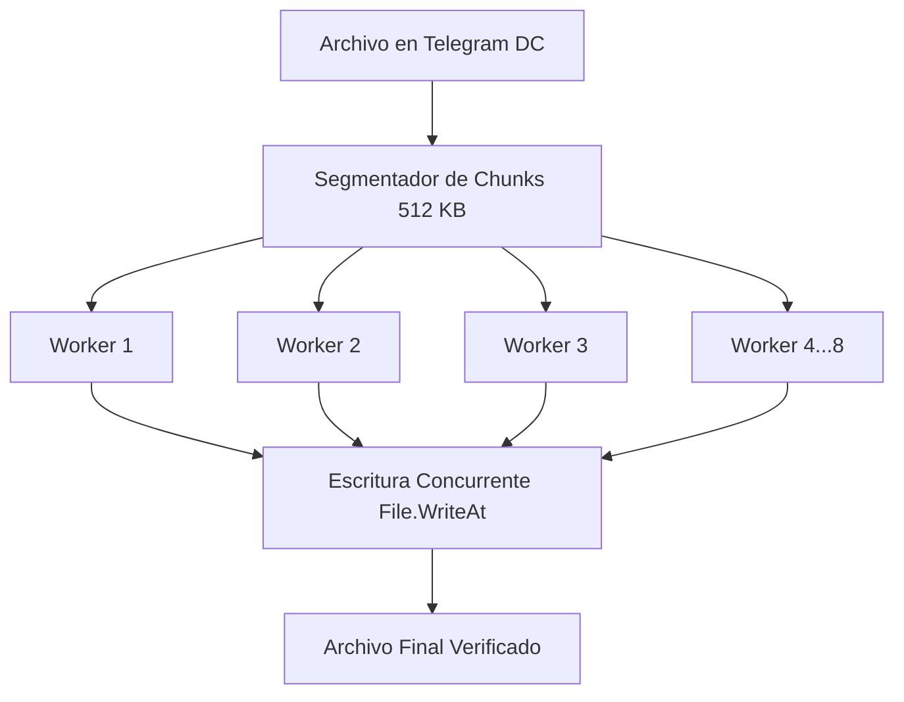

**TelegramDL** está diseñado específicamente para maximizar la velocidad, la fiabilidad y la flexibilidad en la descarga de archivos multimedia de Telegram.

---

## Formatos de Enlace Soportados

TelegramDL cuenta con un analizador sintáctico inteligente (`pkg/downloader/parser.go`) capaz de procesar enlaces directos, rangos continuos y enlaces de temas en supergrupos:

| Formato de Enlace | Tipo | Descripción |
| :--- | :--- | :--- |
| `https://t.me/c/2121902112/31449` | Mensaje único en canal privado | Descarga el archivo del mensaje `31449` |
| `https://t.me/c/2121902112/31449-31455` | **Rango de mensajes** | Encola todos los mensajes desde el `31449` hasta el `31455` |
| `https://t.me/nombrecanal/1234` | Canal o supergrupo público | Descarga el mensaje `1234` del canal público |
| `https://t.me/c/2121902112/450/455` | Mensaje en subtema (topic) | Descarga el mensaje `455` perteneciente al tema `450` |

---

## Motor de Descargas Multihilo por Fragmentos

El motor de descarga (`pkg/downloader/engine.go`) implementa descargas segmentadas en paralelo directamente sobre el protocolo MTProto:

### Características del Motor:
1. **Concurrencia configurable por archivo**: Asigna hasta 8 workers paralelos por descarga, saturando eficientemente el ancho de banda disponible.
2. **Descargas simultáneas globales**: Controladas mediante un semáforo de concurrencia (`MaxConcurrentDownloads`, por defecto 3 tareas activas).
3. **Control de duplicados**: Si el archivo ya existe en disco con el tamaño exacto, la descarga se marca como `skipped` (completada al 100%) sin consumir ancho de banda.
4. **Cálculo de velocidad suavizado**: Se aplica una media móvil exponencial para evitar picos falsos causados por ráfagas de red.

---

## Reanudación Inteligente de Fragmentos

A diferencia de clientes tradicionales que descargan archivos secuencialmente:

- Los bloques descargados se registran en la tabla `download_chunks` de SQLite.
- Los archivos en curso se guardan con la extensión temporal `.temp`.
- Si se interrumpe la conexión, se apaga el ordenador o se pausa la tarea, **no se vuelve a transferir ningún fragmento ya descargado**.
- Al completarse el 100% de los fragmentos, el archivo temporal se renombra automáticamente al nombre final.

---

## Control Total de Tareas

Desde la interfaz o a través de la API REST, puedes controlar cualquier tarea en cualquier momento:

- **Pausar**: Detiene la transferencia de datos y libera los workers para otras descargas en cola.
- **Reanudar**: Vuelve a encolar la tarea y continúa exactamente desde el último fragmento completado.
- **Cancelar**: Cancela el contexto de red activo y marca la tarea como cancelada.
- **Reintentar**: Vuelve a poner en cola una descarga que haya fallado o sido cancelada.
- **Borrar**: Permite eliminar el registro de la base de datos y, opcionalmente, borrar el archivo físico del disco.
- **Limpiar Historial**: Limpia los registros completados, fallidos o cancelados sin tocar los archivos descargados.

---

## Límite de Velocidad (Throttling)

Puedes establecer un límite de velocidad global (en KB/s o MB/s) desde la barra inferior o desde **Ajustes**. El motor ajustará el caudal de recepción de los fragmentos en tiempo real para no saturar tu conexión doméstica o de trabajo.

---

## Apagado Automático al Terminar la Cola

El interruptor **«Apagar al terminar»** de la barra lateral (entre **Ajustes** y tu usuario) arma el apagado del equipo:

- Cuando la cola de descargas se queda vacía tras haber tenido actividad, el servidor espera **15 segundos** de cortesía y apaga el PC.
- Encolar cualquier descarga durante la cuenta atrás **cancela el apagado** automáticamente; también se cancela al desactivar el interruptor o al cerrar la aplicación.
- Mientras el apagado está programado, la barra lateral muestra la **cuenta atrás en tiempo real**.
- El ajuste **no se guarda**: es solo de la sesión, así que cada vez que abras la aplicación tendrás que activarlo de nuevo. Así no hay riesgo de que el PC se apague un día cualquiera porque lo dejaste puesto en otra sesión.

En Windows se apaga con `shutdown /s /t 0` sin forzar el cierre de aplicaciones: si otro programa tiene trabajo sin guardar, puede frenar el apagado.
