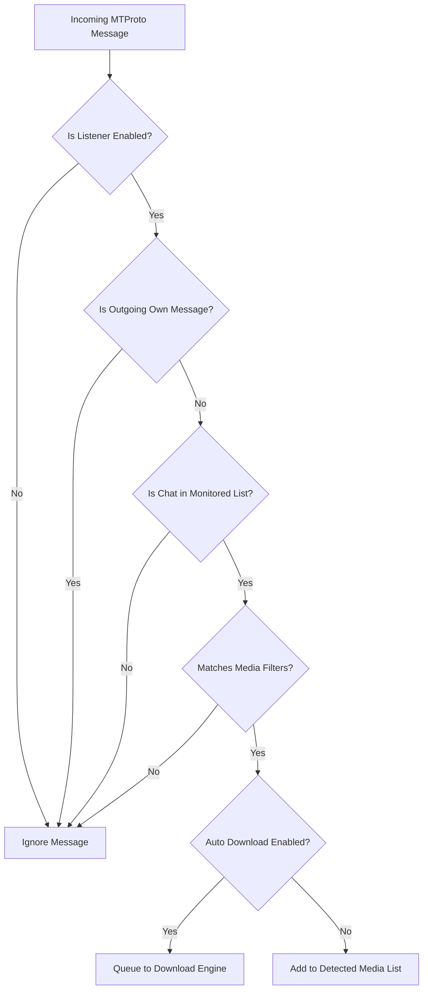

# Listener Mode

The **Listener Mode** transforms TelegramDL into an automated, real-time background monitor for your Telegram channels, groups, and chats.

---

## :material-headphones: How the Listener Works

The listener engine (`pkg/listener/listener.go`) registers directly into the Telegram MTProto event dispatcher:

---

## :material-target: Granular Media Filters

Each monitored chat or channel can be configured with distinct content filters:

- :material-image: **Photos**: Direct images and screenshots.
- :material-video: **Videos**: Movies, TV shows, video clips, and animations.
- :material-music: **Audios / Music**: Songs, voice memos, and audio tracks.
- :material-file-document: **Documents / Files**: Archives (`.zip`, `.rar`, `.7z`), PDFs, software installers, etc.
- :material-sticker-emoji: **Stickers**: Static and animated stickers.

---

## :material-cog: Operating Modes

### 1. Automatic Download (`AutoDownload = true`)
Any incoming media matching your filter criteria is immediately enqueued into the active download pipeline and starts downloading with no manual interaction.

### 2. Manual Detection (`AutoDownload = false`)
Files are staged under the **"Detected Media"** tab with status `available`. You can inspect names, thumbnails, and file sizes, and selectively download items or click **"Download All"**.

---

## :material-rename-box: File Renaming System

TelegramDL allows you to customize the final file names of detected media before enqueuing them for download.

### 1. Per-Chat "Nombre" (Name) Switch
In the **Monitored Chats** list, each chat entry features a **Nombre** toggle switch:
- **Enabled**: Unlocks manual renaming options for all detected files originating from that chat.
- **Disabled**: Files retain their default name without displaying renaming controls.

### 2. Available Name Sources
- **Caption**: Uses the accompanying text caption or message attached to the file in Telegram.
- **Original**: Uses the internal filename embedded in the Telegram media structure when uploaded.

### 3. Per-File Renaming
Under **Detected Media**, any item coming from a chat with the **Nombre** option enabled displays a **Nombre** button next to the Download button:
- Clicking it opens a dropdown menu to choose between **Caption** or **Original** file names.
- Selecting an option immediately renames the file prior to downloading.

### 4. Bulk Renaming ("Nombre" Button in Inbox Header)
Located in the header of the Inbox feed, directly to the left of the **"Todo"** (All) button:
- Offers options to **Use Caption** and **Use Original**.
- **Filtering Rule**: Selecting an option bulk-renames all pending files across the list **exclusively for files originating from chats with the "Nombre" switch enabled**. Files from chats without this option enabled remain completely untouched.

---

## :material-forum: Forum Topics Support

TelegramDL natively supports forum supergroups with topics:

- Monitor the **entire group** (all topics).
- Or pin a **specific topic** (e.g. only watch the *"4K Movies"* topic while ignoring other discussions).
- Topic metadata and names are resolved dynamically via the `/api/listener/topics` endpoint.

---

## :material-alert: Important Isolation Rule

> [!NOTE]
> **Manual link downloads are never restricted by Listener filters.**
> If you paste a direct message link to a photo in the Downloads tab, it will download even if photos are unchecked for that chat in Listener settings. Listener filters exclusively apply to incoming real-time messages.
