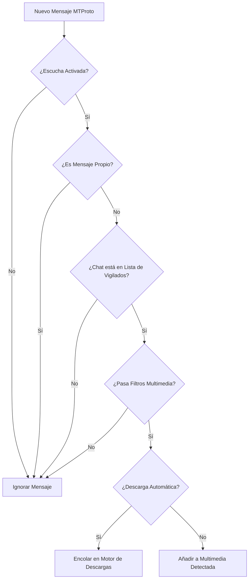

# Modo Escucha (Listener)

El **Modo Escucha** de TelegramDL convierte la aplicación en un receptor automatizado y vigilante en tiempo real de canales, grupos y chats de Telegram.

---

## :material-headphones: ¿Cómo Funciona la Escucha?

El motor de escucha (`pkg/listener/listener.go`) se conecta directamente al despachador de eventos MTProto de Telegram:

---

## :material-target: Filtros Granulares por Tipo de Contenido

Para cada canal o grupo que agregues a la escucha, puedes configurar filtros independientes:

- :material-image: **Fotos**: Imágenes y capturas directas.
- :material-video: **Vídeos**: Películas, series, clips y animaciones de vídeo.
- :material-music: **Audios / Música**: Canciones, notas de voz y pistas de audio.
- :material-file-document: **Documentos / Archivos**: Archivos comprimidos (`.zip`, `.rar`, `.7z`), PDFs, instaladores, etc.
- :material-sticker-emoji: **Stickers**: Stickers estáticos y animados.

---

## :material-cog: Modos de Operación

### 1. Descarga Automática (`AutoDownload = true`)
Cualquier archivo entrante que cumpla con los filtros seleccionados se envía inmediatamente a la cola de descargas activas y comienza a transferirse sin intervención del usuario.

### 2. Detección Manual (`AutoDownload = false`)
Los archivos se registran en la pestaña **"Multimedia Detectada"** con estado disponible. Podrás revisar la lista con vista previa, tamaño y título, y decidir con un solo clic si deseas descargar elementos específicos o pulsar **"Descargar Todo"**.

---

## :material-rename-box: Sistema de Selección y Renombrado de Archivos

TelegramDL permite personalizar el nombre final de los archivos detectados antes de agregarlos a la cola de descargas.

### 1. Conmutador "Nombre" por Chat Vigilado
En la sección de **Chats Vigilados**, cada origen cuenta con un interruptor **Nombre**:
- **Activado**: La aplicación habilita la selección de nombres para todos los archivos detectados que provengan de ese chat.
- **Desactivado**: Los archivos mantendrán su nombre por defecto sin mostrar controles de renombrado.

### 2. Fuentes de Nombre Disponibles
- **Caption**: Extrae y aplica el texto explicativo o pie de mensaje adjunto al archivo en Telegram.
- **Original**: Utiliza el nombre de archivo interno embebido en la estructura del mensaje original.

### 3. Renombrado Individual por Archivo
En la lista de **Multimedia Detectada**, cada elemento perteneciente a un chat con la opción **Nombre** activa dispone de un botón **Nombre**:
- Al hacer clic, despliega un menú flotante para elegir entre el nombre de **Caption** o el nombre **Original**.
- Al seleccionar una opción, el archivo actualiza su nombre de inmediato antes de iniciar la descarga.

### 4. Renombrado Masivo (Botón "Nombre" en la Bandeja de Entrada)
Ubicado en la cabecera de la Bandeja de Entrada, a la izquierda del botón **Todo**:
- Despliega las opciones **Usar Caption** y **Usar Original**.
- **Regla de Filtrado**: Al elegir una opción, se renombrarán de forma masiva todos los archivos pendientes en la lista **únicamente si pertenecen a chats que tienen activa la opción "Nombre"**. Los archivos de chats sin esta opción activa no sufren ninguna modificación.

---

## :material-forum: Soporte para Temas y Foros (Topics)

TelegramDL incluye soporte para supergrupos con temas organizados:

- Puedes vigilar el **grupo completo** (todos los temas).
- O puedes seleccionar un **tema específico** (por ejemplo, vigilar solo el tema *"Películas 4K"* e ignorar el resto de temas del grupo).
- El sistema resuelve los nombres de los temas automáticamente mediante el endpoint `/api/listener/topics`.

---

## :material-alert: Regla Importante de Aislamiento

> [!NOTE]
> **Las descargas manuales introducidas mediante enlace nunca se ven afectadas por los filtros del Listener.**
> Si pegas un enlace directo a una foto en la pestaña de descargas, se descargará aunque en la configuración de ese canal tengas desmarcada la opción de fotos. Los filtros del Listener solo aplican a los mensajes entrantes en tiempo real.
